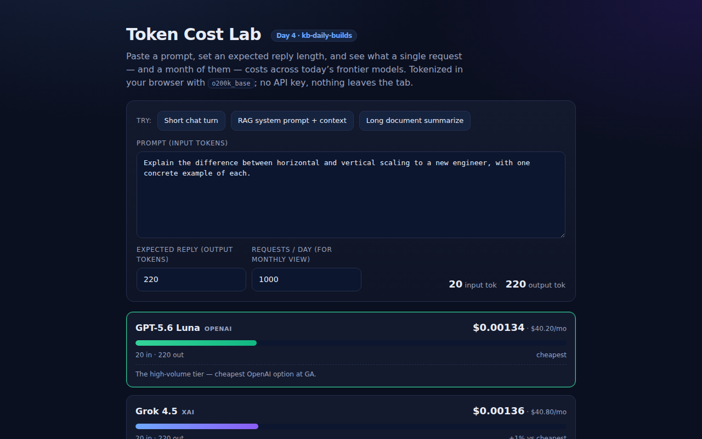

<div align="center">

# Token Cost Lab — See What a Prompt Actually Costs

**Paste a prompt, pick your models, and watch the per-request cost light up across GPT-5.6, Claude Sonnet 5, Grok 4.5 and more — tokenized 100% in your browser, no API key.**

[](https://github.com/kbipul/token-cost-lab/actions/workflows/ci.yml)
[](https://kbipul.github.io/token-cost-lab/)

`Day 4` of **[kb-daily-builds](https://github.com/kbipul/kb-daily-builds)** — one AI project a day.

</div>

## What it does

Grok 4.5 landed on 2026‑07‑09 and GPT‑5.6 Terra/Luna reached general availability the same week, each with new price tiers — so "which model is cheapest for *my* workload?" is a live question again. Token Cost Lab answers it: paste a prompt, set an expected reply length, and it tokenizes the text in your browser and ranks every model by the real per‑request cost, then projects it to a monthly bill at your request volume.

The twist is honesty about tokenization. Sonnet 5 shipped a new tokenizer that emits roughly 42% more tokens on English text than an OpenAI‑style one, so a headline "$/token" hides real spend. Every model here carries an editable **token multiplier** that nudges the browser's count toward that model's actual billing — and every price is editable, because list prices move weekly.



> The screenshot is captured automatically by this repo's CI on a GitHub runner (the build sandbox can't run a browser) and committed to `docs/demo.png` within minutes of publish.

## Try it

**[Live demo →](https://kbipul.github.io/token-cost-lab/)** — runs fully in your browser, nothing to install.

```bash
git clone https://github.com/kbipul/token-cost-lab
cd token-cost-lab
npm ci
npm run dev      # open the printed localhost URL
npm test         # run the cost-math unit tests
npm run build    # type-check + production build
```

## How it works

```
prompt ──► gpt-tokenizer (o200k_base) ──► base token count
                                              │
   per model:  base × tokenMultiplier ──► billed tokens
                                              │
   (tokens ÷ 1e6) × price/1M ──► input$ + output$ ──► ranked bars ──► ×volume ──► monthly$
```

Three deliberate decisions:

1. **One tokenizer, explicit corrections.** Shipping a separate exact tokenizer for every vendor bloats the bundle and still drifts. Instead the app counts once with `o200k_base` and exposes a per‑model multiplier — transparent, editable, and testable — rather than pretending to bill each provider perfectly.
2. **Pure cost math, isolated from React and from the tokenizer.** All pricing arithmetic lives in `src/lib/cost.ts` with zero imports from React or `gpt-tokenizer`, so the logic is covered by fast unit tests and the UI is a thin wiring layer.
3. **Prices are inputs, not facts.** Defaults are seeded from publicly cited July‑2026 list rates and stamped with an "as of" date, but the whole table is editable and resettable — the tool's value is the math, not a claim to be a live price feed.

## Build notes — what I learned

I started this thinking the hard part was pricing data. It wasn't — it was tokenization. The moment you compare providers you're implicitly claiming their token counts are comparable, and they aren't. Sonnet 5's tokenizer change is the clearest example: the same paragraph can be ~40% more tokens, which quietly erases an apparent price advantage. Rather than hide that, I made it a first‑class, editable knob and put the caveat on the screen. It turned a "cost calculator" into something that actually teaches the reader why headline prices mislead.

Keeping the money math pure paid off immediately. Because `cost.ts` never imports React or the tokenizer, I could test six functions — rounding, multiplier application, ranking, monthly scaling, and the currency formatter that has to stay useful from sub‑cent requests to five‑figure monthly bills — without spinning up a DOM or downloading a tokenizer. The React component ended up being almost entirely presentation.

The honesty constraint shaped the product more than any feature did. I only shipped default prices for models I could ground in public reporting this week (GPT‑5.6 Terra/Luna, Sonnet 5, Grok 4.5) and made every field editable with a visible "verify before you rely on this" disclaimer, so the tool is useful without pretending to be a pricing oracle. If I extend it, the next step is an import/export of pricing tables so teams can pin their negotiated enterprise rates.

## Stack

| Layer | Choice |
|---|---|
| UI | React 18 + TypeScript 5 |
| Tokenizer | `gpt-tokenizer` (o200k_base, client‑side) |
| Build/test | Vite 6, Vitest 2 |
| Deploy | GitHub Pages (static, no backend) |

---

<div align="center"><sub>
Built by <a href="https://www.kumarbipul.com"><b>Kumar Bipul</b></a> ·
IT Director → AI/ML · <a href="https://github.com/kbipul">github.com/kbipul</a>
</sub></div>
