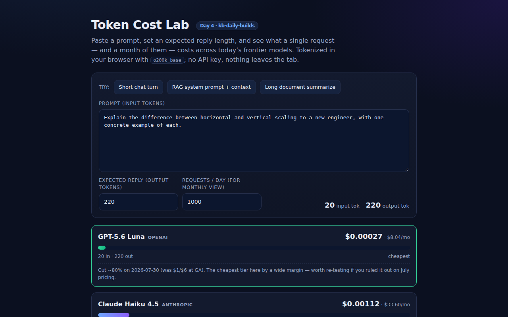

<div align="center">

# Token Cost Lab — See What a Prompt Actually Costs

**Paste a prompt, pick your models, and watch the per-request cost light up across GPT-5.6 Sol/Terra/Luna, Claude Fable 5/Opus 5/Sonnet 5/Haiku 4.5 and Grok 4.5 — tokenized 100% in your browser, no API key.**

[](https://github.com/kbipul/token-cost-lab/actions/workflows/ci.yml)
[](https://kbipul.github.io/token-cost-lab/)

`Day 4` of **[kb-daily-builds](https://github.com/kbipul/kb-daily-builds)** — one AI project a day.

</div>

## What it does

Between 30 July and 21 August 2026, OpenAI cut GPT‑5.6 prices twice, Terra by 20% and Luna by roughly **80%**. On 10 August Anthropic **cancelled** the Sonnet 5 price increase that was due to land on 1 September, making the $2/$10 introductory rate permanent. If you picked a model on July pricing, at least three of your numbers are now wrong, and one of them is wrong by 50%.

Token Cost Lab answers "which model is actually cheapest for *my* workload?" Paste a prompt, set an expected reply length, and it tokenizes the text in your browser and ranks eight frontier models by real per‑request cost, then projects that to a monthly bill at your request volume.

Tokenization is the awkward part. Sonnet 5 ships a tokenizer that emits roughly 42% more tokens on English text than an OpenAI‑style one, so a headline "$/token" hides real spend. Every model carries an editable **token multiplier** that nudges the browser's count toward that model's actual billing. Every price is editable too, because, as the last eight weeks demonstrated, list prices move.



> The screenshot is captured automatically by this repo's CI on a GitHub runner (the build sandbox can't run a browser) and committed to `docs/demo.png` within minutes of publish.

## Try it

**[Live demo →](https://kbipul.github.io/token-cost-lab/)** runs fully in your browser. Nothing to install.

```bash
git clone https://github.com/kbipul/token-cost-lab
cd token-cost-lab
npm ci
npm run dev      # open the printed localhost URL
npm test         # run the cost-math unit tests
npm run build    # type-check + production build
```

## How it works

```
prompt ──► gpt-tokenizer (o200k_base) ──► base token count
                                              │
   per model:  base × tokenMultiplier ──► billed tokens
                                              │
   (tokens ÷ 1e6) × price/1M ──► input$ + output$ ──► ranked bars ──► ×volume ──► monthly$
```

Three decisions there are deliberate.

Shipping a separate exact tokenizer for every vendor bloats the bundle and still drifts, so `src/lib/tokenizer.ts` counts once with `o200k_base` and each model applies its own multiplier on top. That multiplier is editable and testable, which I prefer to pretending the app bills each provider perfectly.

All pricing arithmetic lives in `src/lib/cost.ts`, which imports neither React nor `gpt-tokenizer`. The logic is covered by fast unit tests and `App.tsx` is a thin wiring layer.

Prices are inputs, not facts. Defaults are seeded from publicly cited list rates and stamped with an "as of" date (`PRICES_AS_OF = "2026-09-02"`), each one annotated with what changed and when, and the whole table is editable and resettable.

## Build notes

I started this thinking the hard part was pricing data. It was tokenization. The moment you compare providers you are implicitly claiming their token counts are comparable, and they aren't. Sonnet 5's tokenizer change is the clearest example: the same paragraph can be ~40% more tokens, which quietly erases an apparent price advantage. So the multiplier sits on screen as an editable knob with the caveat printed next to it, rather than as a constant buried in the math.

Keeping the money math pure paid off immediately. Because `cost.ts` never imports React or the tokenizer, I could test all seven of its exports (`tokenCost`, `effectiveTokens`, `costFor`, `rankByCost`, `monthlyCost`, `percentAboveCheapest`, and the `formatUSD` that has to stay useful from sub‑cent requests to five‑figure monthly bills) without spinning up a DOM or downloading a tokenizer. Those tests live in `src/lib/__tests__/cost.test.ts`. The React component ended up being almost entirely presentation.

The first release shipped default prices only for the models I could ground in public reporting that week: GPT‑5.6 Terra/Luna, Sonnet 5, Grok 4.5. Every field is editable and carries a visible "verify before you rely on this" disclaimer. What I still want is an import/export of pricing tables, so teams can pin their negotiated enterprise rates. I have not built it.

### Refresh, 2026-09-02

I came back to this eight weeks after building it and the tool had quietly become wrong.

Three of the four shipped prices had moved. OpenAI cut Terra 20% and Luna about 80% on 30 July, then cut Sol again on 21 August. Anthropic cancelled the Sonnet 5 step‑up on 10 August.

That last one is the instructive failure. The original table hard‑coded $3/$15 with a note saying "intro $2/$10 through Aug 2026". It had **pre‑committed to a future that never happened**, and from 1 September onward it overstated Sonnet 5 by 50%. Encoding a scheduled change as fact is worse than encoding today's price, because it fails silently on a date nobody is watching.

Finding it also required searching the right way. Re‑reading the launch‑week explainers I originally cited would have confirmed every stale number, because those articles are still perfectly accurate *about the launch* and simply silent about anything after it. Re‑verifying a snapshot is not a freshness check. The query that found the truth asked for the *change*: "did this price move since".

In the code, the catalogue went from four models to eight, adding GPT‑5.6 Sol, Claude Opus 5, Haiku 4.5 and Fable 5. I also added `src/lib/__tests__/pricing.test.ts`, twelve tests that guard the invariants a hand‑edited data refresh actually breaks. Duplicate ids. A decimal typo that prices output below input. A multiplier outside a sane band. A `PRICES_AS_OF` stamp dated in the future. A model whose sourcing note went missing. None of that proves a price is right. It proves the table is coherent.

Two things are still open, and I would rather leave them here than fold them into a caveats list.

Opus 5 and Fable 5 keep a 1.0x token multiplier even though they are gen‑5 siblings of Sonnet 5. The ~1.42x inflation has only been publicly measured on Sonnet 5. If the same tokenizer ships across the generation then both models are undercounted here, and I cannot verify that from outside. Guessing would have been the same mistake in a new place, so 1.0x stays until someone measures it.

The high‑context surcharges are the other one. Grok doubles above 200K tokens; Sol bills 2x input above 272K. Both are written into the model notes and neither is modelled, so a request that crosses either threshold is priced too low here. Modelling them halfway would be worse than saying so, but "documented and not modelled" is not where I want this to end up.

## Stack

| Layer | Choice |
|---|---|
| UI | React 18 + TypeScript 5 |
| Tokenizer | `gpt-tokenizer` (o200k_base, client‑side) |
| Build/test | Vite 6, Vitest 2 |
| Deploy | GitHub Pages (static, no backend) |

---

<div align="center"><sub>
Built by <a href="https://www.kumarbipul.com"><b>Kumar Bipul</b></a> ·
IT Director → AI/ML · <a href="https://github.com/kbipul">github.com/kbipul</a>
</sub></div>
